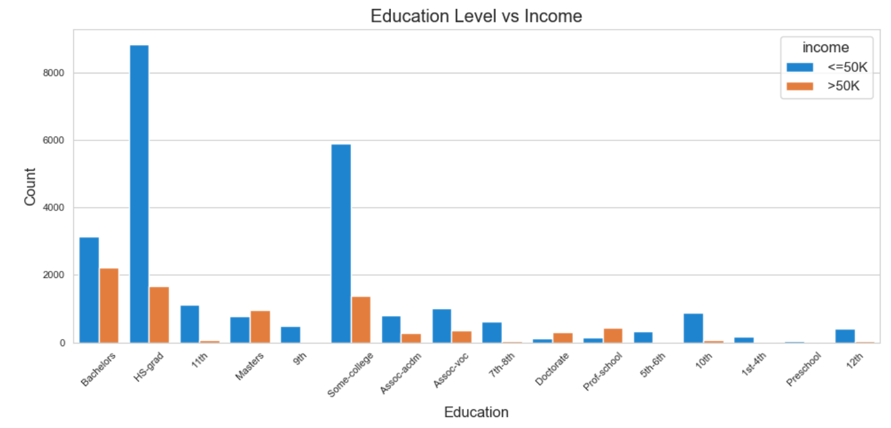

# 📊 Exploratory Data Analysis on Census Income Dataset

## 📌 Project Overview

This project focuses on performing Exploratory Data Analysis (EDA) on the Census Income dataset to understand the key demographic and employment factors that influence income levels.

The objective of this project is to clean the dataset, analyze patterns, and extract meaningful insights using Python-based data analysis techniques.

---

## 🗂 Dataset Information

- Dataset: Census Income Dataset  
- Total Records: 32,560  
- Total Features: 15  
- Target Variable: Income (<=50K, >50K)  
- Contains demographic and employment-related attributes such as:
  - Age  
  - Education  
  - Workclass  
  - Occupation  
  - Marital Status  
  - Capital Gain  
  - Capital Loss  
  - Hours per Week  

---

## 🛠 Technologies Used

- Python  
- Pandas  
- NumPy  
- Matplotlib  
- Seaborn  
- Jupyter Notebook  

---

## 🔎 Steps Performed

### 1️⃣ Data Cleaning
- Checked for missing values  
- Removed unnecessary spaces  
- Verified data types  
- Handled inconsistencies in categorical columns  

### 2️⃣ Univariate Analysis
- Income distribution  
- Age distribution  
- Education distribution  

### 3️⃣ Bivariate Analysis
- Education vs Income  
- Income vs Working Hours  
- Demographic impact on income  

### 4️⃣ Correlation Analysis
- Generated correlation matrix  
- Identified relationships between numerical features  

---

# 📊 Visualizations & Insights

## 📈 Income Distribution


The dataset shows a clear class imbalance, with a significantly higher number of individuals earning ≤50K compared to those earning >50K. This indicates that the majority of the population falls under the lower income category.

---

## 🎓 Education Level vs Income



Higher education levels are associated with a greater proportion of individuals earning >50K. This suggests that education plays an important role in income growth and financial stability.

---

## 👥 Age Distribution


The age distribution is right-skewed, with most individuals concentrated between 25–50 years. This represents the active working-age population in the dataset.

---

## 🔥 Correlation Heatmap


The correlation matrix highlights relationships between numerical variables. Capital gain shows a noticeable positive relationship with income, indicating its influence on higher earnings.

---

## 🎯 Key Insights

- Income distribution is imbalanced.
- Education level strongly impacts income category.
- Capital gain plays a significant role in higher income groups.
- Most individuals fall within the working-age population range.

---

## 🚀 How to Run This Project

1. Clone the repository  
2. Install required libraries:

```bash
pip install pandas numpy matplotlib seaborn
```

3. Open the Jupyter Notebook file  
4. Run all cells  

---

## 👤 Author

**Patri Chaitanya Sri Lalitha Sai**  
Aspiring Data Analyst  
Python | SQL | Data Visualization | EDA  

---

⭐ If you found this project useful, feel free to give it a star!
